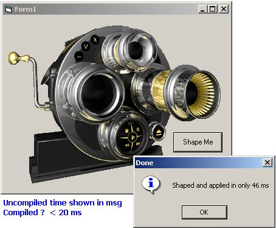



## LaVolpe Window Shaper 3 w/Full Region Class

### Description

(Updated w/more Functions) The attached code will shape a window around a bitmap faster than anything else I've seen on any other site. A simple modification to the code (really optional parameters), can produce the desired results up to 4x faster! Surprised I haven't considered it before. This time the code is moved into a class that has many region-related functions. If the only reason you download is to strip out the RegionFromBitmap function, I think you will also appreciate learning about those other functions. Oh, why is this one faster; cause it uses a method none of the others do -- documented in the code. Patched: 18Nov/1430. SaveRegionToFile fixed, added 1 more ImportRegion option, cleaned-up code, made IsRegion public, &amp; minor touch ups, more comments. 31Jan06/1800z: correct calc errors for rare cases in RegionFromBitmap() &amp; minor tweaks throughout. 1Feb/0200z. Added many more region functions, added more examples in sample project, commented the code to death. History of changes at top of the class module. 2Feb/2130z: Added all remaining functions I can think of and even threw in a Region Collision routine. Short of bugs or bone-head errors, this class is done and now contains 99% of all known functions that actually create, destroy or modify regions.
 
### More Info
 

             |
---                |---
**Submitted On**   |2006-02-02 19:17:18
**By**             |[LaVolpe](https://github.com/Planet-Source-Code/PSCIndex/blob/master/ByAuthor/lavolpe.md)
**Level**          |Intermediate
**User Rating**    |5.0 (144 globes from 29 users)
**Compatibility**  |VB 5\.0, VB 6\.0
**Category**       |[Graphics](https://github.com/Planet-Source-Code/PSCIndex/blob/master/ByCategory/graphics__1-46.md)
**World**          |[Visual Basic](https://github.com/Planet-Source-Code/PSCIndex/blob/master/ByWorld/visual-basic.md)
**Archive File**   |[LaVolpe\_Wi196965232006\.zip](https://github.com/Planet-Source-Code/lavolpe-lavolpe-window-shaper-3-w-full-region-class__1-63291/archive/master.zip)

